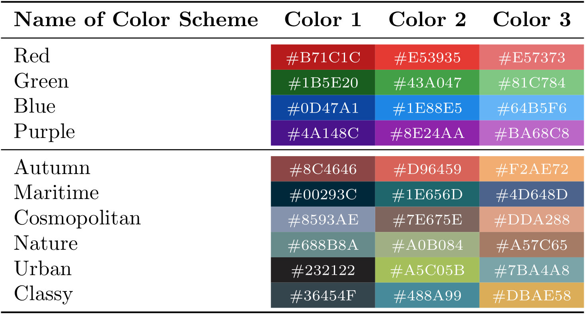

# ModernCS - A Modern Cheat Sheet Class for LaTeX
ModernCS is a custom [LaTeX](https://en.wikipedia.org/wiki/LaTeX) class designed to facilitate the creation of beautiful cheat sheets. It aims to provide a simple set of tools to generate modern looking documents where it's easy to find whatever you're looking for at a glance.

## Table of Contents
1. [Getting Started](#gettingstarted)
    * [Prerequisites](#prerequisites)
    * [Installation](#installation)
    * [Simple Example](#simple)
2. [Features](#features)
    * [Brief Overview of Main Features](#mainfeatures)
    * [Full Documentation](#documentation)
3. [Development](#development)
    * [Dependencies](#dependencies)
    * [Upcoming Features](#upcoming)
4. [Authors and Contributors](#authors)
5. [Acknowledgements](#authors)

## Getting Started

The following three sections briefly touch upon what software you need to have installed on your system and how to use / install the modernCS class for your own cheat sheets. Additionally we provide a simple example of how to work with the class.

### Prerequisites

Since this is a LaTeX class you obviously need to have a working installation of LaTeX itself, I recommend [TeXLive](https://www.tug.org/texlive/). Additionally an editor (e.g. [Sublime](https://www.sublimetext.com/3) with the [LaTeXing](http://www.latexing.com/) package) and a PDF reader (e.g. [Sumatra](https://www.sumatrapdfreader.org/free-pdf-reader.html)) are required.

### Installation
In principle, using the class is as simple as copying the `modernCS.cls` file in the same folder as your `CheatSheet.tex` file and referencing it with `\documentclass{modernCS}`.

You might however want to place the file within a more general directory accessible to your LaTeX distribution of choice, such that you only have one copy on your system even if you have multiple cheat sheets in multiple folders. This also allows you to just change the file in one central location once a new version is released. The steps necessary to accomplish this vary depending on your LaTeX distribution and operating system. A quick google search should enable you to do this in a few minutes.

### Simple Example
Lorem ipsum dolor sit amet, consectetur adipisicing elit, sed do eiusmod
tempor incididunt ut labore et dolore magna aliqua. Ut enim ad minim veniam,
quis nostrud exercitation ullamco laboris nisi ut aliquip ex ea commodo
consequat. Duis aute irure dolor in reprehenderit in voluptate velit esse
cillum dolore eu fugiat nulla pariatur. Excepteur sint occaecat cupidatat non
proident, sunt in culpa qui officia deserunt mollit anim id est laborum.

## Features

### Brief Overview of Main Features
* Great layout presets for a cheat sheet with totally redefined sections and subsections
* 10 beautiful color schemes
* Custom commands for math formulas (e.g. boxed equations)
* Custom command for text definitions
* Customizable title section with links to author's website, Twitter, and GitHub if desired

Here's an overview of all available color schemes:

### Full Documentation
The previous sections covered the majority of important topics, they however can't replace a full technical documentation, which you can find here: [Full Documentation](Documentation/modernCS_Documentation.pdf)

Note that the documentation is still a work in progress and missing a lot of key sections.

## Development

### Dependencies
* [multicol](https://ctan.org/pkg/multicol?lang=en)
* [etoolbox](https://ctan.org/pkg/etoolbox?lang=en)
* [geometry](https://ctan.org/pkg/geometry?lang=en)
* [xcolor](https://ctan.org/pkg/xcolor?lang=en)
* [titlesec](https://ctan.org/pkg/titlesec?lang=en)
* [titling](https://ctan.org/pkg/titling?lang=en)
* [enumitem](https://ctan.org/pkg/enumitem?lang=en)
* [fontawesome](https://www.ctan.org/tex-archive/fonts/fontawesome)
* [hyperref](https://ctan.org/pkg/hyperref?lang=en)
* [mdframed](https://ctan.org/pkg/mdframed?lang=en)
* [empheq](https://ctan.org/pkg/empheq?lang=en)
* [tcolorbox](https://ctan.org/pkg/tcolorbox?lang=en)

### Upcoming Features
* Enable user to pick the amount of columns used as a class option 
* Implement an option to render the entire cheat sheet more compact 
* Possibility to specify a logo for the title section (e.g. the Python logo for a Python cheat sheet) 

## Authors and Contributors

* **Jan P. Guggenbuehler** - Main author

## Acknowledgments

* [ShareLatex - Writing your own class](https://www.sharelatex.com/learn/Writing_your_own_class)
* [James Allen - How to write a LaTeX class file and design your own CV](https://www.sharelatex.com/blog/2011/03/27/how-to-write-a-latex-class-file-and-design-your-own-cv.html)
* [The LaTeX3 Project - LaTeX2e for class and package writers](https://www.latex-project.org/help/documentation/clsguide.pdf)
